# <font color='blue'>PPCA - UnB</font>
# <font color='blue'>Artigo - 1º Semestre 2026</font>

## <font color='blue'>Prestações de Contas Eleitorais de 2024: Uma Análise dos Dados do Tribunal Superior Eleitoral</font>

#### Disciplina: PPCA0028 - Noções Básicas de Seleção de Amostras

#### Professor: Gladston Luiz da Silva

#### Aluno: Adalberto Araujo Aragão

#### Fonte de dados: Portal de Dados Abertos do TSE
 - Dados e Recursos: Extrato bancário
 - Disponível em: https://dadosabertos.tse.jus.br/dataset/prestacao-de-contas-partidarias-2024
 - Acessado em: 09 de abril de 2026


```python
# Versão da Linguagem Python
from platform import python_version
print('Versão da Linguagem Python Usada Neste Jupyter Notebook:', python_version())
```

    Versão da Linguagem Python Usada Neste Jupyter Notebook: 3.13.5
    


```python
# Imports #1
import os
import pyspark
import pandas as pd
import numpy as np
import seaborn as sns
import matplotlib.pyplot as plt
from matplotlib import pyplot
from pyspark import SparkConf, SparkContext
from pyspark.sql import SparkSession, SQLContext
from pyspark.sql.types import *
from pyspark.sql.functions import *
from pyspark.sql.functions import udf
from pyspark.sql.functions import col
import warnings
warnings.filterwarnings("ignore")
```


```python
print(pyspark.__version__)
```

    4.1.1
    


```python
!java -version
```

    java version "17.0.12" 2024-07-16 LTS
    Java(TM) SE Runtime Environment (build 17.0.12+8-LTS-286)
    Java HotSpot(TM) 64-Bit Server VM (build 17.0.12+8-LTS-286, mixed mode, sharing)
    


```python
print(os.environ.get("JAVA_HOME"))
```

    C:\Program Files\Java\jdk-17
    


```python
print(os.environ.get("HADOOP_HOME"))
```

    None
    


```python
# Formatação das saídas
pd.set_option('display.max_columns', 200)
pd.set_option('display.max_colwidth', 400)
from matplotlib.axes._axes import _log as matplotlib_axes_logger
matplotlib_axes_logger.setLevel('ERROR')
```


```python
# CONFIGURAÇÃO DE REPRODUTIBILIDADE

# Seed global
SEED = 42

# Python
import random

random.seed(SEED)
np.random.seed(SEED)
```


```python
# Versões dos pacotes usados nesta sessão "jupyter notebook"
%reload_ext watermark
%watermark -a "Adalberto Araujo Aragão" --iversions
```

    Author: Adalberto Araujo Aragão
    
    numpy     : 2.1.3
    matplotlib: 3.10.0
    pandas    : 2.2.3
    seaborn   : 0.13.2
    platform  : 1.0.8
    pyspark   : 4.1.1
    
    

## Preparando o ambiente Spark


```python
os.environ["JAVA_HOME"] = r"C:\Program Files\Java\jdk-17"
os.environ["PATH"] = os.environ["JAVA_HOME"] + r"\bin;" + os.environ["PATH"]
```


```python
# Configurar Hadoop no Windows
os.environ["HADOOP_HOME"] = "C:\\hadoop"
os.environ["PATH"] += os.pathsep + "C:\\hadoop\\bin"
```


```python
spark_session = (
    SparkSession.builder
    .appName("Spark-TSE")
    .master("local[*]")
    .config("spark.driver.host", "127.0.0.1")
    .config("spark.driver.bindAddress", "127.0.0.1")
    .getOrCreate()
)
```


```python
# Garantir consistência em shuffle (importante para operações distribuídas)
spark_session.conf.set("spark.sql.shuffle.partitions", "200")

# (Opcional) Evitar variação por paralelismo extremo
spark_session.conf.set("spark.default.parallelism", "200")
```


```python
sc = spark_session.sparkContext
```


```python
print(sc)
```

    <SparkContext master=local[*] appName=Spark-TSE>
    


```python
print(spark_session)
```

    <pyspark.sql.session.SparkSession object at 0x000001A72DB37B60>
    

## Carregando e examinando os dados


```python
# Define parâmetros de entrada
input_path = "path/to/dataset.csv"

# Carrega arquivo CSV no Spark preservando campos textuais
df_spark = (
    spark_session.read
    .options(
        delimiter=";",
        header=True,
        inferSchema=False,
        encoding="iso-8859-1",
        quote='"',
        escape='"'
    )
    .csv(input_path)
)
```


```python
# Tipo do objeto
type(df_spark)
```


    pyspark.sql.classic.dataframe.DataFrame


```python
# Visualiza os dados
df_spark.show(5)
```

    +----------+----------+-------------+------------+---------+--------------+--------+----------+----------+--------+--------+---------------+-------------+-------------+-------------+-------------+----------------+--------------------+----------------+----------------+------------------------+-----------------------+---------------------+--------------------+--------------------+--------------------+----------------------+--------------------+
    |DT_GERACAO|HH_GERACAO|AA_REFERENCIA|  SG_PARTIDO|NM_ESFERA|       NR_CNPJ|CD_BANCO|  NM_BANCO|NR_AGENCIA|NR_CONTA|TP_CONTA|   NR_DOCUMENTO|DT_LANCAMENTO|TP_LANCAMENTO|DS_LANCAMENTO|VR_LANCAMENTO|CD_TIPO_OPERACAO|    DS_TIPO_OPERACAO|CD_FONTE_RECURSO|DS_FONTE_RECURSO|DS_DETALHE_FONTE_RECURSO|NR_CPF_CNPJ_CONTRAPARTE|TP_PESSOA_CONTRAPARTE|      NM_CONTRAPARTE|CD_BANCO_CONTRAPARTE|NM_BANCO_CONTRAPARTE|NR_AGENCIA_CONTRAPARTE|NR_CONTA_CONTRAPARTE|
    +----------+----------+-------------+------------+---------+--------------+--------+----------+----------+--------+--------+---------------+-------------+-------------+-------------+-------------+----------------+--------------------+----------------+----------------+------------------------+-----------------------+---------------------+--------------------+--------------------+--------------------+----------------------+--------------------+
    |09/04/2026|  15:48:33|         2024|REPUBLICANOS|Distrital|08052906000161|       1|BCO BRASIL|      3129|  262439|       1|051415409237912|   05/09/2024|            C| PIX RECEBIDO|       100,00|             209|TRANSFERÊNCIA INT...|               2| Outros Recursos|            FP: - FEFC:-|            72283912172|                    1|ELIZABETH FRANCA ...|                  70|BANCO DE BRASILIA SA|                   241|00000000002410030852|
    |09/04/2026|  15:48:33|         2024|REPUBLICANOS|Distrital|08052906000161|       1|BCO BRASIL|      3129|  262439|       1|051440096622622|   05/09/2024|            C| PIX RECEBIDO|        50,00|             209|TRANSFERÊNCIA INT...|               2| Outros Recursos|            FP: - FEFC:-|            66430283372|                    1|Alzira Maria dos ...|                 260|              #NULO#|                     1|00000000000622060295|
    |09/04/2026|  15:48:33|         2024|REPUBLICANOS|Distrital|08052906000161|       1|BCO BRASIL|      3129|  262439|       1|051524247498302|   05/09/2024|            C| PIX RECEBIDO|       636,00|             209|TRANSFERÊNCIA INT...|               2| Outros Recursos|            FP: - FEFC:-|            07888981755|                    1|ALEXANDRE CARDOSO...|                   1|          BCO BRASIL|                  5977|00000000000000149527|
    |09/04/2026|  15:48:33|         2024|REPUBLICANOS|Distrital|08052906000161|       1|BCO BRASIL|      3129|  262439|       1|255528213530261|   05/09/2024|            C| PIX RECEBIDO|        50,00|             209|TRANSFERÊNCIA INT...|               2| Outros Recursos|            FP: - FEFC:-|            66430283372|                    1|Alzira Maria dos ...|                 260|              #NULO#|                     1|00000000000622060295|
    |09/04/2026|  15:48:33|         2024|REPUBLICANOS|Distrital|08052906000161|       1|BCO BRASIL|      3129|  262439|       1|255542092183141|   05/09/2024|            C| PIX RECEBIDO|       192,00|             209|TRANSFERÊNCIA INT...|               2| Outros Recursos|            FP: - FEFC:-|            03615558731|                    1|ANDREA RIBEIRO DA...|                   1|          BCO BRASIL|                   941|00000000000001284649|
    +----------+----------+-------------+------------+---------+--------------+--------+----------+----------+--------+--------+---------------+-------------+-------------+-------------+-------------+----------------+--------------------+----------------+----------------+------------------------+-----------------------+---------------------+--------------------+--------------------+--------------------+----------------------+--------------------+
    only showing top 5 rows
    

## Verificando e limpando os dados ("VR_LANCAMENTO")


```python
# Visualiza os metadados (schema)
df_spark.printSchema()
```

    root
     |-- DT_GERACAO: string (nullable = true)
     |-- HH_GERACAO: string (nullable = true)
     |-- AA_REFERENCIA: string (nullable = true)
     |-- SG_PARTIDO: string (nullable = true)
     |-- NM_ESFERA: string (nullable = true)
     |-- NR_CNPJ: string (nullable = true)
     |-- CD_BANCO: string (nullable = true)
     |-- NM_BANCO: string (nullable = true)
     |-- NR_AGENCIA: string (nullable = true)
     |-- NR_CONTA: string (nullable = true)
     |-- TP_CONTA: string (nullable = true)
     |-- NR_DOCUMENTO: string (nullable = true)
     |-- DT_LANCAMENTO: string (nullable = true)
     |-- TP_LANCAMENTO: string (nullable = true)
     |-- DS_LANCAMENTO: string (nullable = true)
     |-- VR_LANCAMENTO: string (nullable = true)
     |-- CD_TIPO_OPERACAO: string (nullable = true)
     |-- DS_TIPO_OPERACAO: string (nullable = true)
     |-- CD_FONTE_RECURSO: string (nullable = true)
     |-- DS_FONTE_RECURSO: string (nullable = true)
     |-- DS_DETALHE_FONTE_RECURSO: string (nullable = true)
     |-- NR_CPF_CNPJ_CONTRAPARTE: string (nullable = true)
     |-- TP_PESSOA_CONTRAPARTE: string (nullable = true)
     |-- NM_CONTRAPARTE: string (nullable = true)
     |-- CD_BANCO_CONTRAPARTE: string (nullable = true)
     |-- NM_BANCO_CONTRAPARTE: string (nullable = true)
     |-- NR_AGENCIA_CONTRAPARTE: string (nullable = true)
     |-- NR_CONTA_CONTRAPARTE: string (nullable = true)
    
    


```python
# Visualiza valores ausentes
df_spark.select([count(when(col(c).isNull(), c)).alias(c) for c in df_spark.columns]).show()
```

    +----------+----------+-------------+----------+---------+-------+--------+--------+----------+--------+--------+------------+-------------+-------------+-------------+-------------+----------------+----------------+----------------+----------------+------------------------+-----------------------+---------------------+--------------+--------------------+--------------------+----------------------+--------------------+
    |DT_GERACAO|HH_GERACAO|AA_REFERENCIA|SG_PARTIDO|NM_ESFERA|NR_CNPJ|CD_BANCO|NM_BANCO|NR_AGENCIA|NR_CONTA|TP_CONTA|NR_DOCUMENTO|DT_LANCAMENTO|TP_LANCAMENTO|DS_LANCAMENTO|VR_LANCAMENTO|CD_TIPO_OPERACAO|DS_TIPO_OPERACAO|CD_FONTE_RECURSO|DS_FONTE_RECURSO|DS_DETALHE_FONTE_RECURSO|NR_CPF_CNPJ_CONTRAPARTE|TP_PESSOA_CONTRAPARTE|NM_CONTRAPARTE|CD_BANCO_CONTRAPARTE|NM_BANCO_CONTRAPARTE|NR_AGENCIA_CONTRAPARTE|NR_CONTA_CONTRAPARTE|
    +----------+----------+-------------+----------+---------+-------+--------+--------+----------+--------+--------+------------+-------------+-------------+-------------+-------------+----------------+----------------+----------------+----------------+------------------------+-----------------------+---------------------+--------------+--------------------+--------------------+----------------------+--------------------+
    |         0|         0|            0|         0|        0|      0|       0|       0|         0|       0|       0|           0|            0|            0|            0|            0|               0|               0|               0|               0|                       0|                      0|                    0|             0|                   0|                   0|                     0|                   0|
    +----------+----------+-------------+----------+---------+-------+--------+--------+----------+--------+--------+------------+-------------+-------------+-------------+-------------+----------------+----------------+----------------+----------------+------------------------+-----------------------+---------------------+--------------+--------------------+--------------------+----------------------+--------------------+
    
    


```python
# Definir o dataset ANTES do tratamento
n_antes = df_spark.count()

print(n_antes)
```

    1197344
    


```python
# Tratar valores inconsistentes. Substituir '#NULO' e '#NE' por 'None'
from pyspark.sql.functions import when

df_spark = df_spark.replace(['#NULO#', '#NULO', '#NE'], None)
```


```python
from pyspark.sql.functions import col, regexp_replace

# Substituir vírgulas por pontos e transformá-los em numéricos
df_spark = df_spark.withColumn(
    "VR_LANCAMENTO",
    regexp_replace(col("VR_LANCAMENTO"), ",", ".").cast("double")
)
```


```python
# Definir a contagem para valores ausentes
n_nulos_valor = df_spark.filter(col("VR_LANCAMENTO").isNull()).count()

print(n_nulos_valor)
```

    0
    


```python
# Excluir valores ausentes
df_spark = df_spark.na.drop(subset=["VR_LANCAMENTO"])
```


```python
# Definir o dataset DEPOIS do tratamento
n_depois = df_spark.count()

print(n_depois)
```

    1197344
    


```python
# Resulado
print(n_antes, n_nulos_valor, n_depois)
```

    1197344 0 1197344
    


```python
# Verificar valores "zero" (nulos)
df_spark.filter(col("VR_LANCAMENTO") == 0).count()
```


    15


```python
# Validar valores negativos
df_spark.filter(col("VR_LANCAMENTO") < 0).count()
```


    0


```python
# Obter o resumo estatístico da variável de interesse
resumo_estatistico = df_spark.select("VR_LANCAMENTO").describe().show()
```

    +-------+------------------+
    |summary|     VR_LANCAMENTO|
    +-------+------------------+
    |  count|           1197344|
    |   mean|29978.394858286505|
    | stddev|2051300.6450649356|
    |    min|               0.0|
    |    max|    8.8683948785E8|
    +-------+------------------+
    
    


```python
# Selecionar a coluna "VR_LANCAMENTO" e convertê-la para Pandas
df_pandas = df_spark.select("VR_LANCAMENTO").toPandas()

df_valor = df_pandas.dropna()
```


```python
# Mediana (2º Quartil)
mediana = df_valor['VR_LANCAMENTO'].median()
print(mediana)
```

    250.0
    


```python
# Boxplot
plt.figure(figsize=(10, 6))
plt.boxplot(df_valor["VR_LANCAMENTO"], vert=True)
plt.title("Boxplot do Valor de Lançamento")
plt.ylabel("VR_LANCAMENTO")
plt.show()
```


    
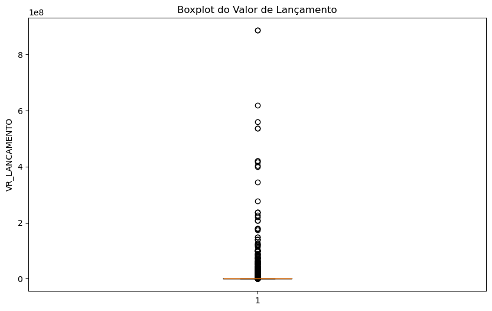
    


```python
# Criar uma variável logarítmica
# Para EDA, visualização, outliers e modelos, VR_LANCAMENTO bruto será dominado pelos extremos.
from pyspark.sql.functions import log1p

df_spark = df_spark.withColumn(
    "LOG_VR_LANCAMENTO",
    log1p(col("VR_LANCAMENTO"))
)
```


```python
# Obter o resumo estatístico da variável logarítmica
resumo_estatistico = df_spark.select("LOG_VR_LANCAMENTO").describe().show()
```

    +-------+-----------------+
    |summary|LOG_VR_LANCAMENTO|
    +-------+-----------------+
    |  count|          1197344|
    |   mean|5.591579030180678|
    | stddev|2.952184302644433|
    |    min|              0.0|
    |    max|20.60317456431583|
    +-------+-----------------+
    
    


```python
# Selecionar a coluna "LOG_VR_LANCAMENTO" e convertê-la para Pandas
df_pandas_log = df_spark.select("LOG_VR_LANCAMENTO").toPandas()

df_valor_log = df_pandas_log.dropna()
```


```python
# Mediana (2º Quartil)
mediana_log = df_valor_log['LOG_VR_LANCAMENTO'].median()
print(mediana_log)
```

    5.5254529391317835
    


```python
# Boxplot
plt.figure(figsize=(10, 6))
plt.boxplot(df_valor_log["LOG_VR_LANCAMENTO"], vert=True)
plt.title("Boxplot do Valor Logarítmico de Lançamento")
plt.ylabel("LOG_VR_LANCAMENTO")
plt.show()
```


    
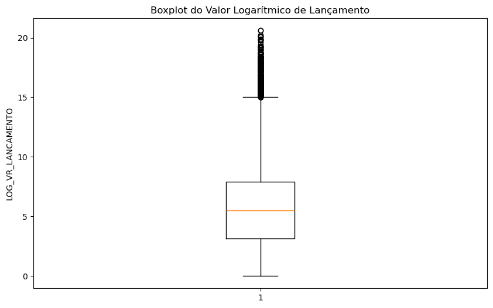
    


```python
# Histograma
plt.figure(figsize=(10, 6))
plt.hist(df_valor_log["LOG_VR_LANCAMENTO"], bins=30, color='skyblue', edgecolor='black')

# Personalizar labels e título
plt.title("Distribuição de LOG_VR_LANCAMENTO")
plt.xlabel("Valor Logarítmico de Lançamento")
plt.ylabel("Frequência")

plt.grid(axis='y', alpha=0.75)
plt.show()
```


    
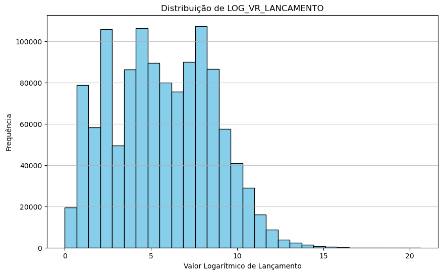
    


```python
# Histograma vs Distribuição Normal
from scipy.stats import norm

# Calcular média (mu) e desvio padrão (std) para a curva teórica
mu, std = norm.fit(df_valor_log)

# 3. Criar o plot
plt.figure(figsize=(10, 6))

# Histograma normalizado (DENSITY=TRUE é obrigatório aqui)
plt.hist(df_valor_log["LOG_VR_LANCAMENTO"], bins=30, density=True, alpha=0.6, color='skyblue', edgecolor='black')

# Criar o eixo X para a curva (do valor mínimo ao máximo dos dados)
xmin, xmax = plt.xlim()
x = np.linspace(xmin, xmax, 100)
p = norm.pdf(x, mu, std) # Calcula a densidade da normal para cada ponto de x

# 4. Plotar a curva gaussiana
plt.plot(x, p, 'r', linewidth=2, label=f'Curva Normal (μ={mu:.2f}, σ={std:.2f})')

plt.title("Histograma vs Distribuição Normal")
plt.xlabel("LOG_VR_LANCAMENTO")
plt.ylabel("Densidade")
plt.legend()
plt.show()
```


    
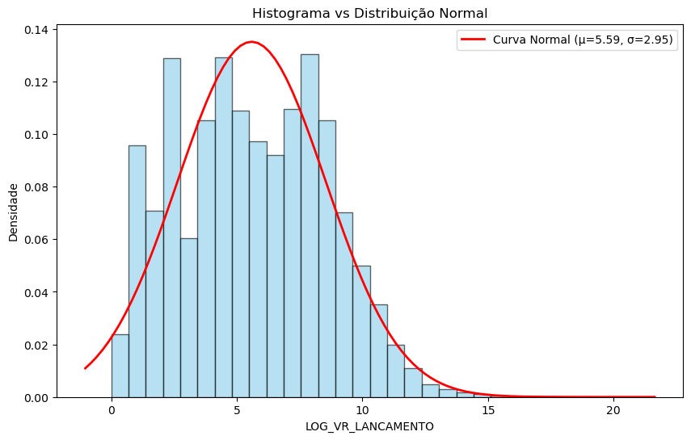
    


# ESTATÍSTICA DESCRITIVA


```python
# Distribuição do número de lançamentos por tipo de operação
df_spark.groupBy('CD_TIPO_OPERACAO').count().orderBy(col('count').desc()).show()
```

    +----------------+------+
    |CD_TIPO_OPERACAO| count|
    +----------------+------+
    |             105|234390|
    |             104|206518|
    |             117|199649|
    |             209|147420|
    |             120|113631|
    |             202| 56583|
    |             213| 42454|
    |             205| 42391|
    |             999| 38748|
    |             206| 22029|
    |             112| 20067|
    |             201| 18230|
    |             101| 17979|
    |             106| 11860|
    |             217|  9195|
    |             215|  7104|
    |             114|  2525|
    |             204|  2017|
    |             203|   980|
    |             214|   866|
    +----------------+------+
    only showing top 20 rows
    


```python
# Distribuição de lançamentos por tipo de pessoa contraparte (Física/Jurídica). Obs.: "-1" indica pessoa não identificada
df_spark.groupBy('TP_PESSOA_CONTRAPARTE').count().show()
```

    +---------------------+------+
    |TP_PESSOA_CONTRAPARTE| count|
    +---------------------+------+
    |                   -1|138388|
    |                    1|326530|
    |                    2|732426|
    +---------------------+------+
    
    

## Verificando a frequência de lançamentos por partido


```python
# Partidos com mais operações
df_spark.groupBy('SG_PARTIDO', 'TP_LANCAMENTO').count().orderBy('count', ascending = False).show()
```

    +------------+-------------+------+
    |  SG_PARTIDO|TP_LANCAMENTO| count|
    +------------+-------------+------+
    |          PT|            D|143418|
    |          PT|            C|112775|
    |         MDB|            D| 81416|
    |          PL|            D| 67746|
    |          PP|            D| 64740|
    |         PSB|            D| 42772|
    |         PSD|            D| 40764|
    |        PSDB|            D| 40726|
    |       UNIÃO|            D| 39760|
    |         PDT|            D| 39686|
    |REPUBLICANOS|            D| 39009|
    |         MDB|            C| 33568|
    |        NOVO|            D| 32487|
    |        PODE|            D| 31846|
    |          PP|            C| 28329|
    |        PSOL|            D| 26453|
    |REPUBLICANOS|            C| 21084|
    |         SDD|            D| 19462|
    |     PC do B|            D| 19134|
    |          UP|            C| 18736|
    +------------+-------------+------+
    only showing top 20 rows
    

## Valor Total por partido e tipo de lançamento


```python
from pyspark.sql.functions import col, sum as _sum

# Agrupar por 'SG_PARTIDO' e 'TP_LANCAMENTO'; após, somar os valores de 'VR_LANCAMENTO'; e, por fim, ordenar
df_spark.groupBy('SG_PARTIDO', 'TP_LANCAMENTO') \
  .agg(_sum('VR_LANCAMENTO').alias('TOTAL_VR_LANCAMENTO')) \
  .orderBy(col('TOTAL_VR_LANCAMENTO').desc()) \
  .show()
```

    +------------+-------------+--------------------+
    |  SG_PARTIDO|TP_LANCAMENTO| TOTAL_VR_LANCAMENTO|
    +------------+-------------+--------------------+
    |          PL|            C|3.0106693688500023E9|
    |          PL|            D| 3.008761227599996E9|
    |       UNIÃO|            D|2.1600058136499996E9|
    |       UNIÃO|            C|     2.15201532834E9|
    |         PSD|            D| 1.696805481440002E9|
    |         PSD|            C|1.6927458924799995E9|
    |         MDB|            D| 1.573810337110032E9|
    |         MDB|            C|1.5721723719399996E9|
    |          PT|            D|1.5314866794200048E9|
    |          PT|            C| 1.531044557749996E9|
    |REPUBLICANOS|            C|1.3935769666500006E9|
    |REPUBLICANOS|            D|     1.39175057087E9|
    |          PP|            C|1.3508662995900004E9|
    |          PP|            D|1.3501629709600046E9|
    |        PODE|            D|1.1948993151400018E9|
    |        PODE|            C|     1.19113617761E9|
    |         PDT|            C| 7.528033278899996E8|
    |         PDT|            D| 7.522547820300006E8|
    |        PSDB|            D| 5.432333500600063E8|
    |        PSDB|            C| 5.398006365499994E8|
    +------------+-------------+--------------------+
    only showing top 20 rows
    

## Valor Total por partido e tipo de operação


```python
# Agrupar por 'SG_PARTIDO' e 'DS_TIPO_OPERACAO'; após, somar os valores de 'VR_LANCAMENTO'; e, por fim, ordenar
df_spark.groupBy('SG_PARTIDO', 'DS_TIPO_OPERACAO') \
  .agg(_sum('VR_LANCAMENTO').alias('TOTAL_VR_LANCAMENTO')) \
  .orderBy(col('TOTAL_VR_LANCAMENTO').desc()) \
  .show()
```

    +------------+--------------------+--------------------+
    |  SG_PARTIDO|    DS_TIPO_OPERACAO| TOTAL_VR_LANCAMENTO|
    +------------+--------------------+--------------------+
    |          PL|TRANSFERÊNCIA ENT...|1.4988558293100002E9|
    |       UNIÃO|TRANSFERÊNCIA ENT...|1.2486690398799999E9|
    |          PL|RESGATE DE APLICAÇÃO|1.1865582553299997E9|
    |          PT|TRANSFERÊNCIA ENT...|     1.18554901387E9|
    |          PL|           APLICAÇÃO|1.1492725848100002E9|
    |          PL| DEPÓSITOS ESPECIAIS|     1.07309974413E9|
    |REPUBLICANOS|TRANSFERÊNCIA ENT...| 9.168189522599999E8|
    |       UNIÃO|RESGATE DE APLICAÇÃO|      9.1633799326E8|
    |       UNIÃO|           APLICAÇÃO|      9.1175904996E8|
    |         PSD|TRANSFERÊNCIA ENT...| 8.620148492900002E8|
    |          PP|TRANSFERÊNCIA ENT...| 8.033158866799998E8|
    |          PT| DEPÓSITOS ESPECIAIS| 7.662821071700002E8|
    |          PT|  LANÇAMENTO AVISADO| 7.625722328099946E8|
    |         PSD|RESGATE DE APLICAÇÃO|       7.583788488E8|
    |         PSD|           APLICAÇÃO| 7.546328732600001E8|
    |        PODE|TRANSFERÊNCIA ENT...| 7.298341141999998E8|
    |         MDB|TRANSFERÊNCIA ENT...| 6.974481790199997E8|
    |          PL|  LANÇAMENTO AVISADO|      6.9356830688E8|
    |         MDB|RESGATE DE APLICAÇÃO| 6.628874105300001E8|
    |         MDB|           APLICAÇÃO| 6.621707794899999E8|
    +------------+--------------------+--------------------+
    only showing top 20 rows
    

## Valor Total por fonte do recurso


```python
# Agrupar por 'DS_FONTE_RECURSO'; após, somar os valores de 'VR_LANCAMENTO'; e, por fim, ordenar
df_spark.groupBy('DS_FONTE_RECURSO') \
  .agg(_sum('VR_LANCAMENTO').alias('TOTAL_VR_LANCAMENTO')) \
  .orderBy(col('TOTAL_VR_LANCAMENTO').desc()) \
  .show()
```

    +--------------------+--------------------+
    |    DS_FONTE_RECURSO| TOTAL_VR_LANCAMENTO|
    +--------------------+--------------------+
    |Fundo Especial de...| 2.84357074533501E10|
    |    Fundo Partidário| 6.409766739989911E9|
    |     Outros Recursos|  6.52726145250001E8|
    |Recursos Para Cam...|      2.7819800089E8|
    |                NULL|1.1269391154999976E8|
    |Fundo Partidário,...|          3168814.64|
    |Fundo Partidário,...|          1438282.39|
    |Recursos Para Cam...|           256587.12|
    |Outros Recursos, ...|           228370.79|
    |Fundo Partidário,...|  144119.19999999998|
    |Outros Recursos, ...|           120933.08|
    |Fundo Partidário,...|             1704.95|
    |Fundo Partidário,...|               150.0|
    +--------------------+--------------------+
    
    

## Análise das contrapartes


```python
# Contrapartes com mais operações
df_spark.groupBy('NM_CONTRAPARTE').count().orderBy('count', ascending = False).show(20)
```

    +--------------------+------+
    |      NM_CONTRAPARTE| count|
    +--------------------+------+
    |BANCO DO BRASIL S.A.|228690|
    |                NULL|121960|
    |CAIXA ECONOMICA F...| 19718|
    |         PT NACIONAL| 17083|
    |TITULO - OUTRO BA...| 10557|
    |SECRETARIA DO TES...|  9014|
    |MINISTERIO DA ECO...|  7254|
    |TITULO - OUTRO BA...|  4980|
    |PARTIDO DOS TRABA...|  3947|
    |     PROPRIO CLIENTE|  3174|
    |      NAO LOCALIZADO|  2788|
    |TITULO - OUTRO BA...|  2704|
    |            CLARO SA|  2552|
    |          Cef Matriz|  2352|
    |BRADESCO/TARIFA B...|  1927|
    |PARTIDO COMUNISTA...|  1840|
    |TITULO - OUTRO BA...|  1800|
    |BANCO DO ESTADO D...|  1776|
    |ELIANE MARQUEZOLO...|  1717|
    |        PARTIDO NOVO|  1557|
    +--------------------+------+
    only showing top 20 rows
    


```python
# Agrupar por 'NM_CONTRAPARTE'; após, somar os valores de 'VR_LANCAMENTO'; e, por fim, ordenar
df_spark.groupBy('NM_CONTRAPARTE') \
  .agg(_sum('VR_LANCAMENTO').alias('TOTAL_VR_LANCAMENTO')) \
  .orderBy(col('TOTAL_VR_LANCAMENTO').desc()) \
  .show()
```

    +--------------------+--------------------+
    |      NM_CONTRAPARTE| TOTAL_VR_LANCAMENTO|
    +--------------------+--------------------+
    |                NULL|1.208868072032003...|
    |TRIBUNAL SUPERIOR...|     4.95434037307E9|
    |PARTIDO LIBERAL - PL|1.1450200591599998E9|
    |FUNDO PARTID¿RIO ...|     1.04525732285E9|
    |        UNIAO BRASIL| 9.152490175500002E8|
    |REPUBLICANOS - BR...| 8.158131147899997E8|
    |PARTIDO DOS TRABA...| 8.043042193299997E8|
    |PARTIDO SOCIAL DE...|      6.0529353724E8|
    |MOVIMENTO DEMOCRA...|      5.9181967656E8|
    |             PODEMOS|      5.7492383588E8|
    |PARTIDO DEMOCRATI...|3.7051727003999996E8|
    |PROGRESSISTAS - B...|      3.4846937536E8|
    |PARTIDO RENOVACAO...|      3.0911687798E8|
    |PARTIDO DOS TRABA...|      2.4523258938E8|
    |PARTIDO SOCIALISM...|2.2229463882000002E8|
    |      NAO LOCALIZADO|      2.1209737336E8|
    |PARTIDO SOCIALIST...|      1.7646828039E8|
    |SOLIDARIEDADE - B...|      1.4801175323E8|
    |FUNDO PARTIDARIO ...|1.4629931067000002E8|
    |        PARTIDO NOVO|1.3588388532999998E8|
    +--------------------+--------------------+
    only showing top 20 rows
    

## Analisando operações por data


```python
from pyspark.sql.functions import to_date

# Convertendo datas para o formato correto
df_spark = df_spark.withColumn('DT_LANCAMENTO', to_date(col('DT_LANCAMENTO'), 'dd/MM/yyyy'))
```


```python
# Lançamentos ao longo do tempo
df_spark.groupBy(year('DT_LANCAMENTO'), month('DT_LANCAMENTO')).sum('VR_LANCAMENTO').orderBy('year(DT_LANCAMENTO)', 'month(DT_LANCAMENTO)').show()
```

    +-------------------+--------------------+--------------------+
    |year(DT_LANCAMENTO)|month(DT_LANCAMENTO)|  sum(VR_LANCAMENTO)|
    +-------------------+--------------------+--------------------+
    |               2023|                  12|          2607108.12|
    |               2024|                   1| 5.648376287499996E8|
    |               2024|                   2|4.4831441079999983E8|
    |               2024|                   3| 4.802717925099998E8|
    |               2024|                   4| 5.294947709100003E8|
    |               2024|                   5| 6.184940931799988E8|
    |               2024|                   6| 5.488414202200005E8|
    |               2024|                   7| 6.181136988400002E8|
    |               2024|                   8|2.135550445010011E10|
    |               2024|                   9| 8.427260966109792E9|
    |               2024|                  10| 1.321707546499997E9|
    |               2024|                  11|      4.7307251612E8|
    |               2024|                  12| 5.059308110399997E8|
    +-------------------+--------------------+--------------------+
    
    

## Bancos com mais operações


```python
# Bancos mais usados
df_spark.groupBy('NM_BANCO').count().orderBy('count', ascending = False).show()
```

    +--------------------+------+
    |            NM_BANCO| count|
    +--------------------+------+
    |          BCO BRASIL|927587|
    |BANCO DO ESTADO D...|121843|
    |CAIXA ECONOMICA F...|105197|
    |        BCO BRADESCO| 13110|
    |            BANESTES|  7352|
    |       BCO SANTANDER|  6252|
    |BANCO DO ESTADO D...|  5692|
    |  ITA? UNIBANCO S.A.|  3755|
    |Banco do Estado d...|  3619|
    |BANCO DE BRASILIA SA|  1795|
    |BANCO DO NORDESTE...|   494|
    |BANCO COOPERATIVO...|   365|
    |BANCO DA AMAZONIA...|   283|
    +--------------------+------+
    
    


```python
bancos_pd = df_spark.groupBy('NM_BANCO').count().orderBy('count', ascending = False).toPandas()

bancos_pd
```


<div>
<style scoped>
    .dataframe tbody tr th:only-of-type {
        vertical-align: middle;
    }

    .dataframe tbody tr th {
        vertical-align: top;
    }

    .dataframe thead th {
        text-align: right;
    }
</style>
<table border="1" class="dataframe">
  <thead>
    <tr style="text-align: right;">
      <th></th>
      <th>NM_BANCO</th>
      <th>count</th>
    </tr>
  </thead>
  <tbody>
    <tr>
      <th>0</th>
      <td>BCO BRASIL</td>
      <td>927587</td>
    </tr>
    <tr>
      <th>1</th>
      <td>BANCO DO ESTADO DO RIO GRANDE DO SUL</td>
      <td>121843</td>
    </tr>
    <tr>
      <th>2</th>
      <td>CAIXA ECONOMICA FEDERAL</td>
      <td>105197</td>
    </tr>
    <tr>
      <th>3</th>
      <td>BCO BRADESCO</td>
      <td>13110</td>
    </tr>
    <tr>
      <th>4</th>
      <td>BANESTES</td>
      <td>7352</td>
    </tr>
    <tr>
      <th>5</th>
      <td>BCO SANTANDER</td>
      <td>6252</td>
    </tr>
    <tr>
      <th>6</th>
      <td>BANCO DO ESTADO DE SERGIPE S.A.</td>
      <td>5692</td>
    </tr>
    <tr>
      <th>7</th>
      <td>ITA? UNIBANCO S.A.</td>
      <td>3755</td>
    </tr>
    <tr>
      <th>8</th>
      <td>Banco do Estado do Par¿</td>
      <td>3619</td>
    </tr>
    <tr>
      <th>9</th>
      <td>BANCO DE BRASILIA SA</td>
      <td>1795</td>
    </tr>
    <tr>
      <th>10</th>
      <td>BANCO DO NORDESTE DO BRASIL S.A</td>
      <td>494</td>
    </tr>
    <tr>
      <th>11</th>
      <td>BANCO COOPERATIVO SICREDI SA</td>
      <td>365</td>
    </tr>
    <tr>
      <th>12</th>
      <td>BANCO DA AMAZONIA S/A</td>
      <td>283</td>
    </tr>
  </tbody>
</table>
</div>


## Verificando a consistência dos dados


```python
# Verificar se todos os lançamentos têm contrapartes válidas
df_spark.select([count(when(col('NR_CPF_CNPJ_CONTRAPARTE').isNull(), 'NR_CPF_CNPJ_CONTRAPARTE')).alias('NR_CPF_CNPJ_CONTRAPARTE'),
           count(when(col('VR_LANCAMENTO').isNull(), 'VR_LANCAMENTO')).alias('VR_LANCAMENTO')]).show()
```

    +-----------------------+-------------+
    |NR_CPF_CNPJ_CONTRAPARTE|VR_LANCAMENTO|
    +-----------------------+-------------+
    |                      0|            0|
    +-----------------------+-------------+
    
    

# SELEÇÃO DE AMOSTRAS BASEADA NA DISTRIBUIÇÃO REAL (DATA-DRIVEN)


```python
from pyspark.sql import functions as F
```


```python
# Usar quantis aproximados
quantis = df_spark.approxQuantile(
    "VR_LANCAMENTO",
    [0.25, 0.50, 0.75, 0.90, 0.95, 0.99, 0.999],
    0.001
)

quantis
```


    [22.5, 250.0, 2711.0, 11000.0, 30000.0, 182658.92, 886839487.85]


```python
# Com os quantis definidos (acima), definimos a faixa de valor
from pyspark.sql.functions import when

df_spark = df_spark.withColumn(
    "faixa_valor",
    when(col("VR_LANCAMENTO") <= 22.5, "E1")
    .when(col("VR_LANCAMENTO") <= 250, "E2")
    .when(col("VR_LANCAMENTO") <= 2700, "E3")
    .when(col("VR_LANCAMENTO") <= 11000, "E4")
    .when(col("VR_LANCAMENTO") <= 30000, "E5")
    .when(col("VR_LANCAMENTO") <= 177500, "E6")
    .when(col("VR_LANCAMENTO") <= 1000000, "E7")
    .otherwise("E8")
)
```


```python
# Estrato final
from pyspark.sql.functions import concat_ws

df_spark = df_spark.withColumn(
    "estrato",
    concat_ws("_",
        col("faixa_valor"),
        col("CD_TIPO_OPERACAO"),
        col("SG_PARTIDO")
    )
)
```

## 1. Parâmetros gerais


```python
N = df_spark.count()
n_target = 10000
frac_aas = n_target / N
R = 30  # número de repetições Monte Carlo
```

## 2. Contagem populacional por estrato: N_h


```python
pop_strata = (
    df_spark
    .groupBy("estrato")
    .agg(F.count("*").alias("N_h"))
    .withColumn("W_h", F.col("N_h") / F.lit(N))
)
```

## 3. Frações da amostra estratificada desproporcional

Ajuste conforme desenho amostral


```python
counts_collect = pop_strata.select("estrato").collect()

fractions_disprop = {}

for row in counts_collect:
    estrato = row["estrato"]

    if estrato.startswith("E8"):
        fractions_disprop[estrato] = 0.20
    elif estrato.startswith("E7"):
        fractions_disprop[estrato] = 0.10
    elif estrato.startswith("E6"):
        fractions_disprop[estrato] = 0.05
    else:
        fractions_disprop[estrato] = 0.005
```

## 4. Funções de amostragem


```python
# Amostragem AAS
def sample_aas(df, frac, seed=SEED):
    return df.sample(withReplacement=False, fraction=frac, seed=seed)

# Amostragem estratificada
def sample_stratified(df, fractions, seed=SEED):
    return df.sampleBy("estrato", fractions=fractions, seed=seed)
```

## 5. Métricas AAS ou STRAT sem ponderação


```python
def metrics_unweighted(df, method, rep):
    stats = df.selectExpr(
        "avg(VR_LANCAMENTO) as mean",
        "stddev_samp(VR_LANCAMENTO) as std",
        "count(*) as n"
    ).collect()[0]

    mean = float(stats["mean"])
    std = float(stats["std"]) if stats["std"] is not None else 0.0
    n = int(stats["n"])

    se = std / (n ** 0.5) if n > 0 else None
    z = 1.96

    qs = df.approxQuantile(
        "VR_LANCAMENTO",
        [0.90, 0.95, 0.99],
        0.001
    )

    return {
        "method": method,
        "rep": rep,
        "n": n,
        "mean": mean,
        "std": std,
        "se": se,
        "ci_low": mean - z * se if se is not None else None,
        "ci_high": mean + z * se if se is not None else None,
        "q90": qs[0],
        "q95": qs[1],
        "q99": qs[2],
    }
```

## 6. Métricas STRAT ponderada

Estimador correto da média:
ybar_st = soma_h W_h * ybar_h


```python
def metrics_strat_weighted(sample_df, pop_strata, method, rep):

    sample_strata = (
        sample_df
        .groupBy("estrato")
        .agg(
            F.count("*").alias("n_h_sample"),
            F.avg("VR_LANCAMENTO").alias("ybar_h"),
            F.var_samp("VR_LANCAMENTO").alias("s2_h")
        )
    )

    pop_strata_clean = (
        pop_strata
        .select(
            F.col("estrato"),
            F.col("N_h").alias("N_h_pop"),
            F.col("W_h").alias("W_h_pop")
        )
    )

    joined = (
        sample_strata
        .join(pop_strata_clean, on="estrato", how="inner")
        .withColumn(
            "weighted_mean_component",
            F.col("W_h_pop") * F.col("ybar_h")
        )
        .withColumn(
            "var_component",
            (F.col("W_h_pop") ** 2) *
            (F.col("s2_h") / F.col("n_h_sample"))
        )
    )

    result = joined.agg(
        F.sum("weighted_mean_component").alias("mean"),
        F.sum("var_component").alias("var_mean")
    ).collect()[0]

    mean = float(result["mean"])
    var_mean = float(result["var_mean"]) if result["var_mean"] is not None else 0.0
    se = var_mean ** 0.5
    z = 1.96

    n_total = sample_df.count()

    qs = sample_df.approxQuantile(
        "VR_LANCAMENTO",
        [0.90, 0.95, 0.99],
        0.001
    )

    return {
        "method": method,
        "rep": rep,
        "n": n_total,
        "mean": mean,
        "std": None,
        "se": se,
        "ci_low": mean - z * se,
        "ci_high": mean + z * se,
        "q90": qs[0],
        "q95": qs[1],
        "q99": qs[2],
    }
```

## 7. Monte Carlo:

AAS vs STRAT sem peso vs STRAT ponderada


```python
# Monte Carlo (seed progressivo)
def monte_carlo_seed(i):
    return SEED + i
```


```python
results = []

for i in range(R):

    seed_i = monte_carlo_seed(i)

    # AAS
    df_aas_i = sample_aas(df_spark, frac_aas, seed=seed_i)
    results.append(
        metrics_unweighted(df_aas_i, method="AAS", rep=i)
    )

    # Estratificada desproporcional
    df_str_i = sample_stratified(df_spark, fractions_disprop, seed=seed_i)

    # STRAT sem ponderação
    results.append(
        metrics_unweighted(df_str_i, method="STRAT_unweighted", rep=i)
    )

    # STRAT ponderada
    results.append(
        metrics_strat_weighted(
            df_str_i,
            pop_strata=pop_strata,
            method="STRAT_weighted",
            rep=i
        )
    )


res_df = pd.DataFrame(results)
```

## 8. Comparações principais


```python
res_df["ci_width"] = res_df["ci_high"] - res_df["ci_low"]

comparacao_media = (
    res_df
    .groupby("method")["mean"]
    .agg(["mean", "std", "min", "max"])
)

comparacao_ic = (
    res_df
    .groupby("method")["ci_width"]
    .agg(["mean", "std", "min", "max"])
)

comparacao_quantis = (
    res_df
    .groupby("method")[["q90", "q95", "q99"]]
    .mean()
)

print("Comparação das médias:")
display(comparacao_media)

print("Comparação da largura dos ICs:")
display(comparacao_ic)

print("Comparação dos quantis superiores:")
display(comparacao_quantis)
```

    Comparação das médias:
    


<div>
<style scoped>
    .dataframe tbody tr th:only-of-type {
        vertical-align: middle;
    }

    .dataframe tbody tr th {
        vertical-align: top;
    }

    .dataframe thead th {
        text-align: right;
    }
</style>
<table border="1" class="dataframe">
  <thead>
    <tr style="text-align: right;">
      <th></th>
      <th>mean</th>
      <th>std</th>
      <th>min</th>
      <th>max</th>
    </tr>
    <tr>
      <th>method</th>
      <th></th>
      <th></th>
      <th></th>
      <th></th>
    </tr>
  </thead>
  <tbody>
    <tr>
      <th>AAS</th>
      <td>28203.204162</td>
      <td>15091.838459</td>
      <td>14581.604768</td>
      <td>80840.138452</td>
    </tr>
    <tr>
      <th>STRAT_unweighted</th>
      <td>613185.678261</td>
      <td>71750.655677</td>
      <td>478112.354001</td>
      <td>756824.441257</td>
    </tr>
    <tr>
      <th>STRAT_weighted</th>
      <td>29112.346760</td>
      <td>3218.760237</td>
      <td>23136.649478</td>
      <td>36103.718349</td>
    </tr>
  </tbody>
</table>
</div>


    Comparação da largura dos ICs:
    


<div>
<style scoped>
    .dataframe tbody tr th:only-of-type {
        vertical-align: middle;
    }

    .dataframe tbody tr th {
        vertical-align: top;
    }

    .dataframe thead th {
        text-align: right;
    }
</style>
<table border="1" class="dataframe">
  <thead>
    <tr style="text-align: right;">
      <th></th>
      <th>mean</th>
      <th>std</th>
      <th>min</th>
      <th>max</th>
    </tr>
    <tr>
      <th>method</th>
      <th></th>
      <th></th>
      <th></th>
      <th></th>
    </tr>
  </thead>
  <tbody>
    <tr>
      <th>AAS</th>
      <td>41469.820406</td>
      <td>47268.067109</td>
      <td>7385.316927</td>
      <td>219446.631345</td>
    </tr>
    <tr>
      <th>STRAT_unweighted</th>
      <td>405918.604232</td>
      <td>93683.043151</td>
      <td>240236.173677</td>
      <td>624657.435220</td>
    </tr>
    <tr>
      <th>STRAT_weighted</th>
      <td>15569.493498</td>
      <td>4933.778882</td>
      <td>7379.063791</td>
      <td>28815.215354</td>
    </tr>
  </tbody>
</table>
</div>


    Comparação dos quantis superiores:
    


<div>
<style scoped>
    .dataframe tbody tr th:only-of-type {
        vertical-align: middle;
    }

    .dataframe tbody tr th {
        vertical-align: top;
    }

    .dataframe thead th {
        text-align: right;
    }
</style>
<table border="1" class="dataframe">
  <thead>
    <tr style="text-align: right;">
      <th></th>
      <th>q90</th>
      <th>q95</th>
      <th>q99</th>
    </tr>
    <tr>
      <th>method</th>
      <th></th>
      <th></th>
      <th></th>
    </tr>
  </thead>
  <tbody>
    <tr>
      <th>AAS</th>
      <td>11088.361333</td>
      <td>3.012019e+04</td>
      <td>1.752107e+05</td>
    </tr>
    <tr>
      <th>STRAT_unweighted</th>
      <td>363233.789000</td>
      <td>1.262157e+06</td>
      <td>6.544715e+06</td>
    </tr>
    <tr>
      <th>STRAT_weighted</th>
      <td>363233.789000</td>
      <td>1.262157e+06</td>
      <td>6.544715e+06</td>
    </tr>
  </tbody>
</table>
</div>


# DETECÇÃO DE OUTLIERS


```python
# Quantis da variável "VR_LANCAMENTO"
df_spark.approxQuantile(
    "VR_LANCAMENTO",
    [0.99, 0.995, 0.999],
    0.001
)
```


    [182658.92, 400000.0, 886839487.85]


```python
# Contagem de zeros
df_spark.filter(col("VR_LANCAMENTO") == 0).count()
```


    15


```python
# Quantis da variável "LOG_VR_LANCAMENTO" (adicional)
df_spark.approxQuantile(
    "LOG_VR_LANCAMENTO",
    [0.25, 0.5, 0.75, 0.9, 0.99],
    0.001
)
```


    [3.157000421150113,
     5.5254529391317835,
     7.905441649060286,
     9.305741456739435,
     12.115381342273386]


## Critério híbrido: quantis + log


```python
# Criar a categoria de outlier
df_spark = df_spark.withColumn(
    "categoria_outlier",
    when(col("VR_LANCAMENTO") <= 30000, "normal")
    .when(col("VR_LANCAMENTO") <= 182658.92, "intermediario")
    .otherwise("extremo")
)
```


```python
# Função para calcular proporções
def proporcao_outliers(df, nome_metodo):
    total = df.count()
    
    return (
        df.groupBy("categoria_outlier")
          .agg(F.count("*").alias("n"))
          .withColumn("proporcao", F.col("n") / F.lit(total))
          .withColumn("method", F.lit(nome_metodo))
    )
```


```python
# Comparar AAS vs STRAT_unweighted
# Usamos uma repetição específica (seed=42)
df_aas = sample_aas(df_spark, frac_aas, seed=SEED)

df_strat = sample_stratified(
    df_spark,
    fractions=fractions_disprop,
    seed=SEED
)

# Agora calculamos
prop_aas = proporcao_outliers(df_aas, "AAS")
prop_strat = proporcao_outliers(df_strat, "STRAT_unweighted")

comparacao_outliers = prop_aas.unionByName(prop_strat)

comparacao_outliers.orderBy("method", "categoria_outlier").show()
```

    +-----------------+----+--------------------+----------------+
    |categoria_outlier|   n|           proporcao|          method|
    +-----------------+----+--------------------+----------------+
    |          extremo| 102|0.010035419126328217|             AAS|
    |    intermediario| 406| 0.03994490358126722|             AAS|
    |           normal|9656|  0.9500196772924046|             AAS|
    |          extremo|1514| 0.15866694613288618|STRAT_unweighted|
    |    intermediario|2291| 0.24009641584573466|STRAT_unweighted|
    |           normal|5737|  0.6012366380213792|STRAT_unweighted|
    +-----------------+----+--------------------+----------------+
    
    


```python
# Proporção populacional de referência
prop_pop = proporcao_outliers(df_spark, "POPULACAO")

prop_pop.orderBy("categoria_outlier").show()
```

    +-----------------+-------+--------------------+---------+
    |categoria_outlier|      n|           proporcao|   method|
    +-----------------+-------+--------------------+---------+
    |          extremo|  12418|0.010371288451773259|POPULACAO|
    |    intermediario|  45268| 0.03780701285511933|POPULACAO|
    |           normal|1139658|  0.9518216986931074|POPULACAO|
    +-----------------+-------+--------------------+---------+
    
    


```python
# Agora, usaremos pesos por estrato para estimar a proporção populacional de cada categoria
def proporcao_outliers_weighted(sample_df, pop_strata, nome_metodo):
    # total amostral por estrato
    n_por_estrato = (
        sample_df
        .groupBy("estrato")
        .agg(F.count("*").alias("n_h_sample"))
    )

    # contagem por estrato e categoria
    cat_por_estrato = (
        sample_df
        .groupBy("estrato", "categoria_outlier")
        .agg(F.count("*").alias("n_ch"))
    )

    # proporção da categoria dentro de cada estrato
    prop_cat_estrato = (
        cat_por_estrato
        .join(n_por_estrato, on="estrato", how="inner")
        .withColumn("p_ch", F.col("n_ch") / F.col("n_h_sample"))
    )

    pop_strata_clean = (
        pop_strata
        .select(
            F.col("estrato"),
            F.col("W_h").alias("W_h_pop")
        )
    )

    # estimador estratificado ponderado da proporção
    prop_weighted = (
        prop_cat_estrato
        .join(pop_strata_clean, on="estrato", how="inner")
        .withColumn("weighted_component", F.col("W_h_pop") * F.col("p_ch"))
        .groupBy("categoria_outlier")
        .agg(F.sum("weighted_component").alias("proporcao"))
        .withColumn("method", F.lit(nome_metodo))
    )

    return prop_weighted
```


```python
# Agora comparamos os três
df_aas = sample_aas(df_spark, frac_aas, seed=SEED)

df_strat = sample_stratified(
    df_spark,
    fractions=fractions_disprop,
    seed=SEED
)

prop_pop = proporcao_outliers(df_spark, "POPULACAO")
prop_aas = proporcao_outliers(df_aas, "AAS")
prop_strat_unw = proporcao_outliers(df_strat, "STRAT_unweighted")
prop_strat_w = proporcao_outliers_weighted(df_strat, pop_strata, "STRAT_weighted")

comparacao_outliers = (
    prop_pop
    .select("method", "categoria_outlier", "proporcao")
    .unionByName(prop_aas.select("method", "categoria_outlier", "proporcao"))
    .unionByName(prop_strat_unw.select("method", "categoria_outlier", "proporcao"))
    .unionByName(prop_strat_w.select("method", "categoria_outlier", "proporcao"))
)

comparacao_outliers.orderBy("categoria_outlier", "method").show(truncate=False)
```

    +----------------+-----------------+--------------------+
    |method          |categoria_outlier|proporcao           |
    +----------------+-----------------+--------------------+
    |AAS             |extremo          |0.010035419126328217|
    |POPULACAO       |extremo          |0.010371288451773259|
    |STRAT_unweighted|extremo          |0.15866694613288618 |
    |STRAT_weighted  |extremo          |0.009984736911306564|
    |AAS             |intermediario    |0.03994490358126722 |
    |POPULACAO       |intermediario    |0.03780701285511933 |
    |STRAT_unweighted|intermediario    |0.24009641584573466 |
    |STRAT_weighted  |intermediario    |0.037085278055152555|
    |AAS             |normal           |0.9500196772924046  |
    |POPULACAO       |normal           |0.9518216986931074  |
    |STRAT_unweighted|normal           |0.6012366380213792  |
    |STRAT_weighted  |normal           |0.8982297485100361  |
    +----------------+-----------------+--------------------+
    
    


```python
# Para uma melhor visualização em Pandas
comparacao_pd = comparacao_outliers.toPandas()

comparacao_pivot = comparacao_pd.pivot(
    index="categoria_outlier",
    columns="method",
    values="proporcao"
)

comparacao_pivot
```


<div>
<style scoped>
    .dataframe tbody tr th:only-of-type {
        vertical-align: middle;
    }

    .dataframe tbody tr th {
        vertical-align: top;
    }

    .dataframe thead th {
        text-align: right;
    }
</style>
<table border="1" class="dataframe">
  <thead>
    <tr style="text-align: right;">
      <th>method</th>
      <th>AAS</th>
      <th>POPULACAO</th>
      <th>STRAT_unweighted</th>
      <th>STRAT_weighted</th>
    </tr>
    <tr>
      <th>categoria_outlier</th>
      <th></th>
      <th></th>
      <th></th>
      <th></th>
    </tr>
  </thead>
  <tbody>
    <tr>
      <th>extremo</th>
      <td>0.010035</td>
      <td>0.010371</td>
      <td>0.158667</td>
      <td>0.009985</td>
    </tr>
    <tr>
      <th>intermediario</th>
      <td>0.039945</td>
      <td>0.037807</td>
      <td>0.240096</td>
      <td>0.037085</td>
    </tr>
    <tr>
      <th>normal</th>
      <td>0.950020</td>
      <td>0.951822</td>
      <td>0.601237</td>
      <td>0.898230</td>
    </tr>
  </tbody>
</table>
</div>


```python
# Erro Absoluto por método
erro_df = comparacao_pivot.copy()

for col in ["AAS", "STRAT_unweighted", "STRAT_weighted"]:
    erro_df[col + "_erro"] = np.abs(erro_df[col] - erro_df["POPULACAO"])
    
erro_df
```


<div>
<style scoped>
    .dataframe tbody tr th:only-of-type {
        vertical-align: middle;
    }

    .dataframe tbody tr th {
        vertical-align: top;
    }

    .dataframe thead th {
        text-align: right;
    }
</style>
<table border="1" class="dataframe">
  <thead>
    <tr style="text-align: right;">
      <th>method</th>
      <th>AAS</th>
      <th>POPULACAO</th>
      <th>STRAT_unweighted</th>
      <th>STRAT_weighted</th>
      <th>AAS_erro</th>
      <th>STRAT_unweighted_erro</th>
      <th>STRAT_weighted_erro</th>
    </tr>
    <tr>
      <th>categoria_outlier</th>
      <th></th>
      <th></th>
      <th></th>
      <th></th>
      <th></th>
      <th></th>
      <th></th>
    </tr>
  </thead>
  <tbody>
    <tr>
      <th>extremo</th>
      <td>0.010035</td>
      <td>0.010371</td>
      <td>0.158667</td>
      <td>0.009985</td>
      <td>0.000336</td>
      <td>0.148296</td>
      <td>0.000387</td>
    </tr>
    <tr>
      <th>intermediario</th>
      <td>0.039945</td>
      <td>0.037807</td>
      <td>0.240096</td>
      <td>0.037085</td>
      <td>0.002138</td>
      <td>0.202289</td>
      <td>0.000722</td>
    </tr>
    <tr>
      <th>normal</th>
      <td>0.950020</td>
      <td>0.951822</td>
      <td>0.601237</td>
      <td>0.898230</td>
      <td>0.001802</td>
      <td>0.350585</td>
      <td>0.053592</td>
    </tr>
  </tbody>
</table>
</div>


```python
# Erro Médio Total
erro_total = erro_df[[
    "AAS_erro",
    "STRAT_unweighted_erro",
    "STRAT_weighted_erro"
]].mean()

erro_total
```


    method
    AAS_erro                 0.001425
    STRAT_unweighted_erro    0.233723
    STRAT_weighted_erro      0.018233
    dtype: float64


```python
# Divergência de Distribuição
# Jensen-Shannon
from scipy.spatial.distance import jensenshannon

def js_divergence(p, q):
    return jensenshannon(p, q)

p_pop = comparacao_pivot["POPULACAO"].values

for metodo in ["AAS", "STRAT_unweighted", "STRAT_weighted"]:
    q = comparacao_pivot[metodo].values
    print(metodo, js_divergence(p_pop, q))
```

    AAS 0.004062856151065086
    STRAT_unweighted 0.31637755484232183
    STRAT_weighted 0.0027134016597647054
    

## Impacto Financeiro Global


```python
impacto_financeiro = (
    df_spark
    .groupBy("categoria_outlier")
    .agg(
        F.count("*").alias("n"),
        F.sum("VR_LANCAMENTO").alias("valor_total")
    )
)

total_geral = df_spark.agg(
    F.sum("VR_LANCAMENTO").alias("total")
).collect()[0]["total"]

impacto_financeiro = impacto_financeiro.withColumn(
    "proporcao_registros",
    F.col("n") / F.lit(df_spark.count())
).withColumn(
    "proporcao_valor",
    F.col("valor_total") / F.lit(total_geral)
)

impacto_financeiro.orderBy("proporcao_valor", ascending=False).show(truncate=False)
```

    +-----------------+-------+---------------------+--------------------+-------------------+
    |categoria_outlier|n      |valor_total          |proporcao_registros |proporcao_valor    |
    +-----------------+-------+---------------------+--------------------+-------------------+
    |extremo          |12418  |3.0063103474629986E10|0.010371288451773259|0.8375418054469174 |
    |intermediario    |45268  |3.267937083859999E9  |0.03780701285511933 |0.09104295993967486|
    |normal           |1139658|2.5634106547100606E9 |0.9518216986931074  |0.07141523461340357|
    +-----------------+-------+---------------------+--------------------+-------------------+
    
    


```python
# Curva De Concentração (PARETO)
df_pandas = df_spark.select("VR_LANCAMENTO").toPandas()

df_pandas = df_pandas.sort_values("VR_LANCAMENTO", ascending=False)

df_pandas["cum_valor"] = df_pandas["VR_LANCAMENTO"].cumsum()
df_pandas["cum_perc"] = df_pandas["cum_valor"] / df_pandas["VR_LANCAMENTO"].sum()

df_pandas["rank_perc"] = np.arange(1, len(df_pandas)+1) / len(df_pandas)

# Visualização
plt.figure(figsize=(8,6))
plt.plot(df_pandas["rank_perc"], df_pandas["cum_perc"])
plt.xlabel("Proporção de registros")
plt.ylabel("Proporção acumulada do valor")
plt.title("Curva de concentração (Pareto)")
plt.grid(True)
plt.show()
```


    
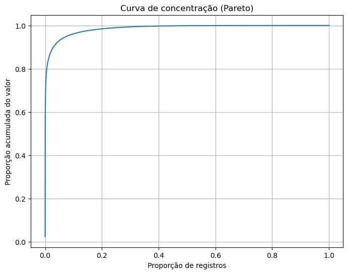
    


```python
# Métrica Formal (GINI)
def gini(array):
    array = np.sort(array)
    n = len(array)
    index = np.arange(1, n + 1)
    return (2 * np.sum(index * array) / (n * np.sum(array))) - (n + 1) / n

gini_index = gini(df_pandas["VR_LANCAMENTO"].values)
gini_index
```


    np.float64(0.9735457384569755)


# DETECÇÃO DE OUTLIERS POR MEIO DE ML: CLUSTERIZAÇÃO (K-MEANS EM ESCALA LOG)


```python
# Base e feature
df_cluster = df_spark.select(
    "VR_LANCAMENTO",
    "LOG_VR_LANCAMENTO",
    "categoria_outlier"
).toPandas()

X = df_cluster[["LOG_VR_LANCAMENTO"]].values
```


```python
# Escolha K usando uma amostra
from sklearn.cluster import KMeans
from sklearn.metrics import silhouette_score

# amostra para escolha de K
df_cluster_sample = (
    df_spark
    .select("VR_LANCAMENTO", "LOG_VR_LANCAMENTO", "categoria_outlier")
    .sample(withReplacement=False, fraction=0.05, seed=SEED)
    .toPandas()
)

X_sample = df_cluster_sample[["LOG_VR_LANCAMENTO"]].values

inertias = []
silhouettes = []
K_range = range(2, 7)

for k in K_range:
    km = KMeans(n_clusters=k, random_state=SEED, n_init=10)
    labels = km.fit_predict(X_sample)
    
    inertias.append(km.inertia_)
    
    silhouettes.append(
        silhouette_score(X_sample, labels, sample_size=10000, random_state=SEED)
    )
```


```python
# Gráfico Elbow Method
plt.figure(figsize=(6,4))
plt.plot(list(K_range), inertias, marker="o")
plt.xlabel("K")
plt.ylabel("Inertia")
plt.title("Elbow Method - amostra")
plt.grid(True)
plt.show()
```


    
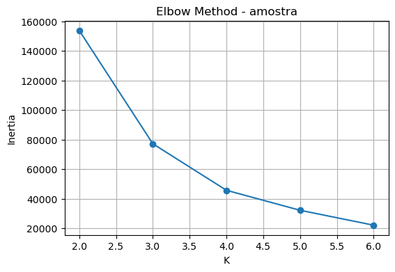
    


```python
# Gráfico Silhouette Score
plt.figure(figsize=(6,4))
plt.plot(list(K_range), silhouettes, marker="o")
plt.xlabel("K")
plt.ylabel("Silhouette")
plt.title("Silhouette Score - amostra")
plt.grid(True)
plt.show()
```


    
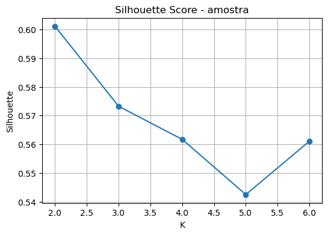
    


```python
# Aplicação do K-Means na base completa em relação à variável (LOG_VR_LANCAMENTO), utilizando o PySpark
from pyspark.ml.feature import VectorAssembler
from pyspark.ml.clustering import KMeans

def kmeans_model(df, k=3, seed=SEED):
    return KMeans(
        k=k,
        seed=seed,
        featuresCol="features",
        predictionCol="cluster"
    )

assembler = VectorAssembler(
    inputCols=["LOG_VR_LANCAMENTO"],
    outputCol="features"
)

df_kmeans = assembler.transform(df_spark)

kmeans = kmeans_model(df_kmeans, k=3, seed=SEED)

model = kmeans.fit(df_kmeans)

df_clustered = model.transform(df_kmeans)

cluster_stats = (
    df_clustered
    .groupBy("cluster")
    .agg(F.mean("VR_LANCAMENTO").alias("media"))
    .orderBy("media")  # ordena do menor para o maior
)

cluster_stats.show()
```

    +-------+-----------------+
    |cluster|            media|
    +-------+-----------------+
    |      1| 10.9907217173382|
    |      0|347.3782893344329|
    |      2|89009.51721603605|
    +-------+-----------------+
    
    


```python
# Criar mapeamento ordenado
# coletar clusters ordenados
clusters_ordenados = [row["cluster"] for row in cluster_stats.collect()]

mapping = {
    clusters_ordenados[i]: i
    for i in range(len(clusters_ordenados))
}
```


```python
# Aplicar nova ordenação
from pyspark.sql.functions import create_map, lit
from itertools import chain

# transformar dict em expressão Spark
mapping_expr = create_map(
    [lit(x) for x in chain(*mapping.items())]
)

df_clustered = df_clustered.withColumn(
    "cluster_ord",
    mapping_expr[F.col("cluster")]
)
```


```python
# Criar rótulo semântico
df_clustered = df_clustered.withColumn(
    "cluster_label",
    F.when(F.col("cluster_ord") == 0, "normal")
     .when(F.col("cluster_ord") == 1, "intermediario")
     .when(F.col("cluster_ord") == 2, "extremo")
)
```


```python
df_clustered.groupBy("cluster_label").agg(
    F.count("*").alias("n"),
    F.mean("VR_LANCAMENTO").alias("media")
).orderBy("media").show()
```

    +-------------+------+-----------------+
    |cluster_label|     n|            media|
    +-------------+------+-----------------+
    |       normal|355527| 10.9907217173382|
    |intermediario|440314|347.3782893344329|
    |      extremo|401503|89009.51721603605|
    +-------------+------+-----------------+
    
    


```python
# Resumo dos clusters
resumo_clusters = (
    df_clustered
    .groupBy("cluster_label")
    .agg(
        F.count("*").alias("n"),
        F.mean("VR_LANCAMENTO").alias("media"),
        F.expr("percentile_approx(VR_LANCAMENTO, 0.5)").alias("mediana"),
        F.min("VR_LANCAMENTO").alias("minimo"),
        F.expr("percentile_approx(VR_LANCAMENTO, 0.90)").alias("q90"),
        F.expr("percentile_approx(VR_LANCAMENTO, 0.95)").alias("q95"),
        F.expr("percentile_approx(VR_LANCAMENTO, 0.99)").alias("q99"),
        F.max("VR_LANCAMENTO").alias("maximo")
    )
    .orderBy("media")
)

resumo_clusters.show(truncate=False)
```

    +-------------+------+-----------------+-------+------+-------+---------+---------+--------------+
    |cluster_label|n     |media            |mediana|minimo|q90    |q95      |q99      |maximo        |
    +-------------+------+-----------------+-------+------+-------+---------+---------+--------------+
    |normal       |355527|10.9907217173382 |9.0    |0.0   |30.0   |30.7     |40.0     |40.81         |
    |intermediario|440314|347.3782893344329|200.0  |40.82 |978.0  |1000.0   |1226.95  |1290.9        |
    |extremo      |401503|89009.51721603605|5000.0 |1291.0|50000.0|100973.77|684451.44|8.8683948785E8|
    +-------------+------+-----------------+-------+------+-------+---------+---------+--------------+
    
    


```python
# Impacto Financeiro por Cluster
impacto_cluster = (
    df_clustered
    .groupBy("cluster_label")
    .agg(
        F.count("*").alias("n"),
        F.sum("VR_LANCAMENTO").alias("valor_total")
    )
)

total_valor = df_clustered.agg(
    F.sum("VR_LANCAMENTO")
).collect()[0][0]

impacto_cluster = impacto_cluster.withColumn(
    "prop_registros",
    F.col("n") / F.lit(df_clustered.count())
).withColumn(
    "prop_valor",
    F.col("valor_total") / F.lit(total_valor)
)

impacto_cluster_pd = impacto_cluster.orderBy("prop_valor", ascending=False).toPandas()

print(impacto_cluster_pd)
```

       cluster_label       n   valor_total  prop_registros  prop_valor
    0        extremo  401503  3.573759e+10        0.335328    0.995630
    1  intermediario  440314  1.529555e+08        0.367742    0.004261
    2         normal  355527  3.907498e+06        0.296930    0.000109
    


```python
# Visualização gráfica
# Boxplot em escala log
df_plot = df_clustered.select(
    "cluster_label", "LOG_VR_LANCAMENTO"
).toPandas().sort_values("cluster_label")

plt.figure(figsize=(8,5))
sns.boxplot(
    data=df_plot,
    x="cluster_label",
    y="LOG_VR_LANCAMENTO"
)
plt.title("Distribuição log por cluster")
plt.show()
```


    
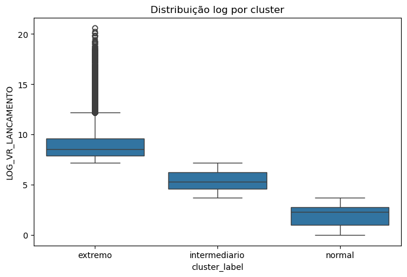
    


```python
# Densidade
plt.figure(figsize=(8,5))

for c in sorted(df_plot["cluster_label"].unique()):
    subset = df_plot[df_plot["cluster_label"] == c]
    sns.kdeplot(
        subset["LOG_VR_LANCAMENTO"],
        label=f"Cluster {c}"
    )

plt.legend()
plt.title("Densidade dos clusters (log)")
plt.show()
```


    
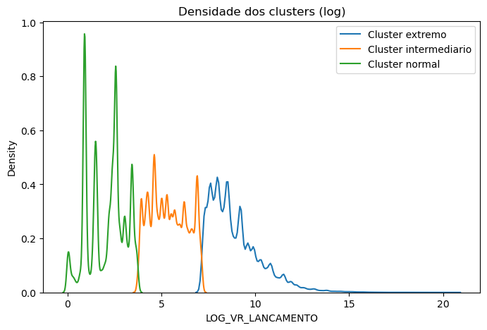
    


```python
# Scatter simples (1D expandido)
plt.figure(figsize=(8,3))

sns.scatterplot(
    data=df_plot.sample(5000),
    x="LOG_VR_LANCAMENTO",
    y=[0]*5000,
    hue="cluster_label",
    palette="brg",
    alpha=0.6
)

plt.yticks([])
plt.title("Separação dos clusters (log)")
plt.show()
```


    
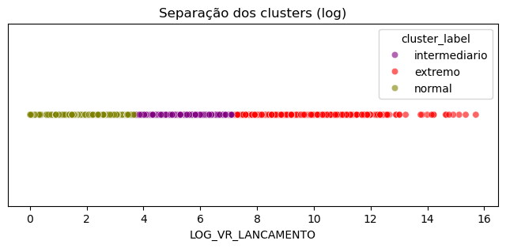
    


# ANÁLISE DE GRAFOS


```python
# 1. Base: somente extremos, C/D e PF/PJ
df_grafo = (
    df_spark
    .filter(F.col("categoria_outlier") == "extremo")
    .filter(F.col("TP_LANCAMENTO").isin(["C", "D"]))
    .filter(F.col("TP_PESSOA_CONTRAPARTE").isin(["1", "2"]))
    .select(
        "SG_PARTIDO",
        "TP_LANCAMENTO",
        "VR_LANCAMENTO",
        "NR_CPF_CNPJ_CONTRAPARTE",
        "NM_CONTRAPARTE",
        "TP_PESSOA_CONTRAPARTE"
    )
)
```


```python
# 2. Agregar para reduzir o grafo
df_edges = (
    df_grafo
    .groupBy(
        "SG_PARTIDO",
        "TP_LANCAMENTO",
        "NR_CPF_CNPJ_CONTRAPARTE",
        "NM_CONTRAPARTE",
        "TP_PESSOA_CONTRAPARTE"
    )
    .agg(
        F.sum("VR_LANCAMENTO").alias("valor_total"),
        F.count("*").alias("n_transacoes")
    )
    .orderBy(F.col("valor_total").desc())
)

TOP_N = 160
edges_pd = df_edges.limit(TOP_N).toPandas()
```


```python
import networkx as nx

G = nx.Graph()

def contraparte_label(row):
    tipo = "PF" if row["TP_PESSOA_CONTRAPARTE"] == "1" else "PJ"
    return f"{tipo}_{row['NR_CPF_CNPJ_CONTRAPARTE']}"

for i, row in edges_pd.iterrows():
    partido = f"PARTIDO: {row['SG_PARTIDO']}"
    contraparte = contraparte_label(row)
    valor_node = f"{row['TP_LANCAMENTO']}: R$ {row['valor_total']:,.0f}"

    valor = float(row["valor_total"])
    tp = row["TP_LANCAMENTO"]

    # Nós
    G.add_node(partido, tipo="partido", label=row["SG_PARTIDO"], valor=valor)
    G.add_node(
        valor_node,
        tipo="valor",
        label="Crédito" if tp == "C" else "Débito",
        valor=valor,
        tp_lancamento=tp
    )
    G.add_node(
        contraparte,
        tipo="contraparte",
        label=contraparte,
        valor=valor
    )

    # Arestas
    G.add_edge(partido, valor_node, weight=valor)
    G.add_edge(valor_node, contraparte, weight=valor)
```


```python
# 3. Atributos visuais
import builtins

node_colors = []
node_sizes = []
labels = {}

# apenas valores dos nós de transação
valores = [
    data["valor"]
    for n, data in G.nodes(data=True)
    if data["tipo"] == "valor"
]

max_valor = builtins.max(valores) if valores else 1

for n, data in G.nodes(data=True):

    tipo = data["tipo"]

    # PARTIDOS
    if tipo == "partido":
        node_colors.append("#FFF7AE")
        node_sizes.append(900)
        labels[n] = data["label"]

    # NÓS DE VALOR (CRÉDITO / DÉBITO)
    elif tipo == "valor":

        # tamanho proporcional ao valor
        size = 100 + 10000 * (
            (data["valor"] / max_valor) ** 0.3
        )
        node_sizes.append(size)

        # cor por tipo de lançamento
        if data["tp_lancamento"] == "C":
            node_colors.append("#5BE36D")  # crédito
        else:
            node_colors.append("#E85D5D")  # débito

        labels[n] = ""  # sem rótulo

    # CONTRAPARTES
    else:
        node_colors.append("#9FD3E6")
        node_sizes.append(350)

        # PF ou PJ
        if data.get("tp_pessoa") == "1":
            labels[n] = "PF"
        else:
            labels[n] = "PJ"
```


```python
# Criar Dicionários De Rótulos
labels_partido = {}
labels_contraparte = {}

for n, data in G.nodes(data=True):
    if data["tipo"] == "partido":
        labels_partido[n] = data["label"]

    elif data["tipo"] == "contraparte":
        if data.get("tp_pessoa") == "1":
            labels_contraparte[n] = "PF"
        else:
            labels_contraparte[n] = "PJ"
```


```python
# 4. Layout e visualização

plt.figure(figsize=(16, 14))

pos = nx.spring_layout(
    G,
    k=0.55,
    seed=SEED,
    iterations=100
)

edge_weights = np.array([G[u][v]["weight"] for u, v in G.edges()])
edge_widths = 0.5 + 3 * (np.log1p(edge_weights) / np.log1p(edge_weights.max()))

nx.draw_networkx_edges(
    G,
    pos,
    width=edge_widths,
    alpha=0.35,
    edge_color="gray"
)

nx.draw_networkx_nodes(
    G,
    pos,
    node_color=node_colors,
    node_size=node_sizes,
    alpha=0.88,
    linewidths=0.7,
    edgecolors="black"
)

nx.draw_networkx_labels(
    G,
    pos,
    labels=labels_partido,
    font_size=16,
    font_weight="bold"
)

nx.draw_networkx_labels(
    G,
    pos,
    labels=labels_contraparte,
    font_size=10
)

# Legenda
import matplotlib.patches as mpatches

legend_items = [
    mpatches.Patch(color="#FFF7AE", label="Partido"),
    mpatches.Patch(color="#5BE36D", label="Crédito"),
    mpatches.Patch(color="#E85D5D", label="Débito"),
    mpatches.Patch(color="#9FD3E6", label="Contraparte PF/PJ"),
]

plt.legend(handles=legend_items, loc="upper right", fontsize=16)
plt.title("Rede de fluxos extremos por partido, tipo de lançamento e contraparte", fontsize=20)
plt.axis("off")
plt.tight_layout()
plt.show()
```


    
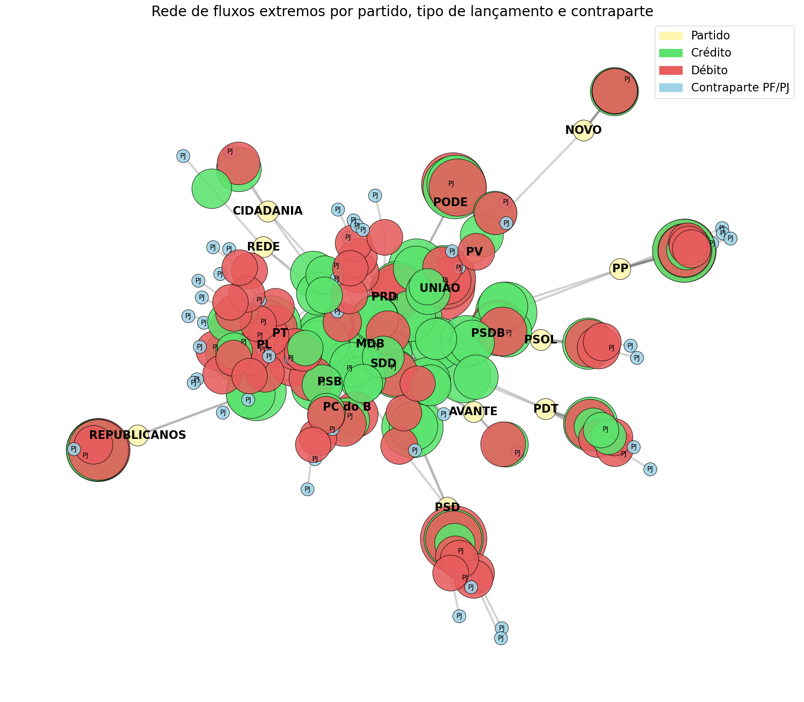
    


## Análise realizada a partir das 10 principais legendas


```python
from pyspark.sql import functions as F

# Base filtrada
df_grafo_base = (
    df_spark
    .filter(F.col("categoria_outlier") == "extremo")
    .filter(F.col("TP_LANCAMENTO").isin(["C", "D"]))
    .filter(F.col("TP_PESSOA_CONTRAPARTE").isin(["1", "2"]))
)

# Partidos que possuem tanto crédito quanto débito
partidos_cd = (
    df_grafo_base
    .groupBy("SG_PARTIDO")
    .agg(
        F.countDistinct("TP_LANCAMENTO").alias("n_tipos_lancamento"),
        F.sum("VR_LANCAMENTO").alias("valor_total")
    )
    .filter(F.col("n_tipos_lancamento") == 2)
    .orderBy(F.col("valor_total").desc())
    .limit(10)
)

# Lista dos 10 partidos
top_10_partidos = [row["SG_PARTIDO"] for row in partidos_cd.collect()]

top_10_partidos
```


    ['PL',
     'UNIÃO',
     'REPUBLICANOS',
     'PT',
     'PSD',
     'PP',
     'PODE',
     'MDB',
     'PDT',
     'PSDB']


```python
df_grafo = (
    df_grafo_base
    .filter(F.col("SG_PARTIDO").isin(top_10_partidos))
    .select(
        "SG_PARTIDO",
        "TP_LANCAMENTO",
        "VR_LANCAMENTO",
        "NR_CPF_CNPJ_CONTRAPARTE",
        "NM_CONTRAPARTE",
        "TP_PESSOA_CONTRAPARTE"
    )
)
```


```python
# 2. Agregar para reduzir o grafo
df_edges = (
    df_grafo
    .groupBy(
        "SG_PARTIDO",
        "TP_LANCAMENTO",
        "NR_CPF_CNPJ_CONTRAPARTE",
        "NM_CONTRAPARTE",
        "TP_PESSOA_CONTRAPARTE"
    )
    .agg(
        F.sum("VR_LANCAMENTO").alias("valor_total"),
        F.count("*").alias("n_transacoes")
    )
    .orderBy(F.col("valor_total").desc())
)

TOP_N = 60
edges_pd = df_edges.limit(TOP_N).toPandas()
```


```python
import networkx as nx

G = nx.Graph()

def contraparte_label(row):
    tipo = "PF" if row["TP_PESSOA_CONTRAPARTE"] == "1" else "PJ"
    return f"{tipo}_{row['NR_CPF_CNPJ_CONTRAPARTE']}"

for i, row in edges_pd.iterrows():
    partido = f"PARTIDO: {row['SG_PARTIDO']}"
    contraparte = contraparte_label(row)
    valor_node = f"{row['TP_LANCAMENTO']}: R$ {row['valor_total']:,.0f}"

    valor = float(row["valor_total"])
    tp = row["TP_LANCAMENTO"]

    # Nós
    G.add_node(partido, tipo="partido", label=row["SG_PARTIDO"], valor=valor)
    G.add_node(
        valor_node,
        tipo="valor",
        label="Crédito" if tp == "C" else "Débito",
        valor=valor,
        tp_lancamento=tp
    )
    G.add_node(
        contraparte,
        tipo="contraparte",
        label=contraparte,
        valor=valor
    )

    # Arestas
    G.add_edge(partido, valor_node, weight=valor)
    G.add_edge(valor_node, contraparte, weight=valor)
```


```python
# 3. Atributos visuais
import builtins

node_colors = []
node_sizes = []
labels = {}

# apenas valores dos nós de transação
valores = [
    data["valor"]
    for n, data in G.nodes(data=True)
    if data["tipo"] == "valor"
]

max_valor = builtins.max(valores) if valores else 1

for n, data in G.nodes(data=True):

    tipo = data["tipo"]

    # PARTIDOS
    if tipo == "partido":
        node_colors.append("#FFF7AE")
        node_sizes.append(900)
        labels[n] = data["label"]

    # NÓS DE VALOR (CRÉDITO / DÉBITO)
    elif tipo == "valor":

        # tamanho proporcional ao valor
        size = 100 + 8000 * (
            (data["valor"] / max_valor) ** 0.3
        )
        node_sizes.append(size)

        # cor por tipo de lançamento
        if data["tp_lancamento"] == "C":
            node_colors.append("#5BE36D")  # crédito
        else:
            node_colors.append("#E85D5D")  # débito

        labels[n] = ""  # sem rótulo

    # CONTRAPARTES
    else:
        node_colors.append("#9FD3E6")
        node_sizes.append(350)

        # PF ou PJ
        if data.get("tp_pessoa") == "1":
            labels[n] = "PF"
        else:
            labels[n] = "PJ"
```


```python
# Criar Dicionários De Rótulos
labels_partido = {}
labels_contraparte = {}

for n, data in G.nodes(data=True):
    if data["tipo"] == "partido":
        labels_partido[n] = data["label"]

    elif data["tipo"] == "contraparte":
        if data.get("tp_pessoa") == "1":
            labels_contraparte[n] = "PF"
        else:
            labels_contraparte[n] = "PJ"
```


```python
# 4. Layout e visualização

plt.figure(figsize=(16, 14))

pos = nx.spring_layout(
    G,
    k=0.55,
    seed=SEED,
    iterations=100
)

edge_weights = np.array([G[u][v]["weight"] for u, v in G.edges()])
edge_widths = 0.5 + 3 * (np.log1p(edge_weights) / np.log1p(edge_weights.max()))

nx.draw_networkx_edges(
    G,
    pos,
    width=edge_widths,
    alpha=0.35,
    edge_color="gray"
)

nx.draw_networkx_nodes(
    G,
    pos,
    node_color=node_colors,
    node_size=node_sizes,
    alpha=0.88,
    linewidths=0.7,
    edgecolors="black"
)

nx.draw_networkx_labels(
    G,
    pos,
    labels=labels_partido,
    font_size=20,
    font_weight="bold"
)

nx.draw_networkx_labels(
    G,
    pos,
    labels=labels_contraparte,
    font_size=16
)

# Legenda
import matplotlib.patches as mpatches

legend_items = [
    mpatches.Patch(color="#FFF7AE", label="Partido"),
    mpatches.Patch(color="#5BE36D", label="Crédito"),
    mpatches.Patch(color="#E85D5D", label="Débito"),
    mpatches.Patch(color="#9FD3E6", label="Contraparte PF/PJ"),
]

plt.legend(handles=legend_items, loc="upper right", fontsize=16)
plt.title("Rede de fluxos extremos por partido, tipo de lançamento e contraparte", fontsize=20)
plt.axis("off")
plt.tight_layout()
plt.show()
```


    
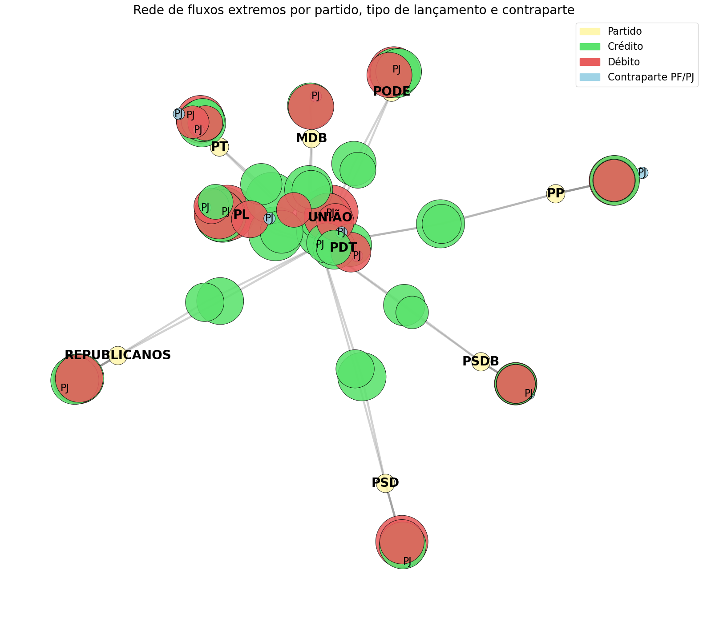
    


```python
# Encerra a sessão Spark
spark_session.stop()
```

# Fim
